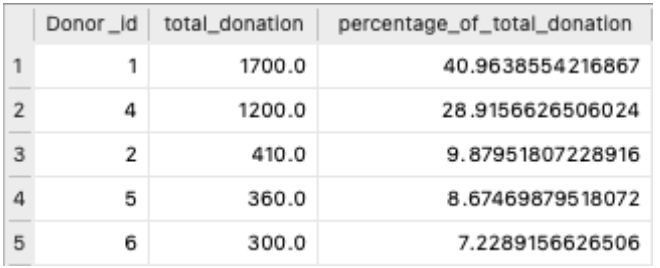
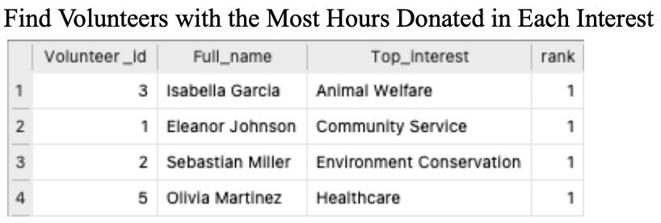

<p align="center">

</p>

> A comprehensive relational database design that centralizes information, enabling more effective resource allocation, volunteer deployment, fundraising efforts, streamlined processes, and community engagement for non-profit organizations.

<a name="toc"/></a>
## Table of Contents

1. [Abstract](#abstract)
    
2. [Background](#background)
 
3. [Approach](#approach)

4. [Results](#results)

5. [Conclusions](#conclusions) 

6. [References](#references)

<a name="abstract"/></a>
## 1. Abstract
[Back to ToC](#toc)

During my 2022 summer internship at ICNA Relief, a non-profit dedicated to aiding the underprivileged and disaster-affected, I identified operational inefficiencies in resource allocation and community outreach. The reliance on registration forms for clients and volunteers, coupled with Excel spreadsheets for tracking inventories and donations, hindered their ability to optimize processes. Armed with my newly acquired knowledge of database systems from class, I resolved to design and implement a comprehensive relational database that could centralize information, allowing for more effective resource allocation and community engagement. To achieve this, I utilized ER diagrams to design a relational database to centralize donor, volunteer, client, inventory, donation, and event data. Applying SQL functionalities, including joins, subqueries, and aggregates, I developed complex queries to identify total donation amounts, top donors, percentage of donations from top donors, and volunteers with the most hours donated per interest. These insights enable ICNA Relief to recognize top contributors, target fundraising efforts to increase contributions, and strategically assign volunteers to areas where their skills and contributions are impactful. Additionally, I implemented triggers for real-time updates of essential inventories during events. These features streamlined ICNA Relief's processes, preventing data loss from outdated tracking methods. This database-driven solution exemplifies a transformative approach, fostering efficient resource allocation and robust community engagement at ICNA Relief, aligning seamlessly with the organization's commitment to making a positive impact.

<a name="background"/></a>
## 2. Background
[Back to ToC](#toc)

In my internship at ICNA Relief last summer, I discovered a passion for volunteering in social service programs, witnessing firsthand the dedication of the staff in addressing the immediate needs of individuals facing crises, such as house fires. Inspired by the organization's commitment to community welfare, I recognized the potential to enhance their mission by leveraging data-driven solutions. This led to the conceptualization of a project aimed at designing and implementing a comprehensive database to identify organizational flaws, expand volunteer participation, and strategically deploy resources.

While the staff at ICNA Relief is dedicated to identifying people in need, organizing events, recruiting volunteers, and attracting donations, they still rely on registration forms for clients and volunteers, coupled with Excel spreadsheets for tracking inventories and donations,
hindering their ability to optimize processes. As highlighted by Antoine in his article, "What Can a Nonprofit Database Do for Your Organization?" [1] and articulated by C. J. Date in the renowned book "An Introduction to Database Systems,"[2] transitioning to a relational database solution presents numerous advantages. Firstly, it allows for centralized storage of data, providing a single point of access for all relevant information, including client details, volunteer records, inventory levels, and donation history. This minimizes the need to navigate through multiple forms and spreadsheets. Secondly, it makes retrieving specific information more efficient. Queries can be formulated to extract precise data, reducing the time and effort required to locate critical details compared to manual searches in forms or spreadsheets. Thirdly, it enforces data integrity through constraints and relationships and ensures that information is accurate and consistent, reducing the likelihood of errors compared to manual data entry in forms or spreadsheets. Additionally, it also supports automation through triggers. This enables the automation of repetitive tasks, such as updating inventory levels after distribution via food pantry events, reducing manual effort and improving efficiency compared to manual tracking in Excel spreadsheets.

In addition, I sought to address specific challenges in resource allocation, volunteer deployment, and fundraising efforts. For instance, implementing triggers to identify top volunteers and highlighting high-status donors in real time on social media aimed to recognize and incentivize contributions. Moreover, the database would aid in identifying overlooked donation items, allowing for targeted fundraising efforts to address specific needs.
 

<a name="Aapproach"/></a>
## 3. Approach
[Back to ToC](#toc) 

In implementing the database for ICNA Relief, I followed a systematic approach to ensure an effective and comprehensive solution. The foundation of the project was built on principles from renowned database design methodologies and best practices, incorporating key design choices to address the unique needs of ICNA Relief's operations.

The initial phase involved gathering requirements by understanding ICNA Relief's existing workflows, pain points, and aspirations for improvement based on my experience working for the organization last summer. This information served as a basis for the Entity-Relationship (ER) modeling process. Utilizing ER diagrams, I delineated the relationships between various entities such as clients, volunteers, donors, inventory items, donations, and events to capture all relevant information seamlessly.

When determining the attributes for each entity, I not only gathered basic information, such as age, gender, and full name for Staff, Volunteers, and Clients, but also added attributes to tailor the specific requirements for each entity. For example, I included an income attribute for Clients to determine their eligibility for food pantry programs and a Has_children attribute to ensure they receive essentials tailored to their needs. I also added Hours_worked to the entity connecting volunteers to events to enable users to efficiently retrieve their volunteer hours without searching through spreadsheets. For Donation, Essentials and Distributes entities,
attributes to quantify the items were added in order to identify resource shortage, ensuring optimal operation across the organization.

For the database implementation, I used Structured Query Language (SQL) to create tables, define relationships, and formulate complex queries. I leveraged SQL's powerful functionality, including joins, subqueries, and aggregates, to develop intricate queries for extracting valuable insights, such as identifying top donors, the expertise of volunteers, and the statuses of top donors. In some cases, I created views for complex queries and queried on top of those views to produce the desired results. For instance, to find Volunteers with the Most Hours Donated in Each Interest, I first created a view to retrieve the total hours worked for each volunteer, a view to rank all volunteers based on hours worked categorized by their interest, and then wrote a query to retrieve the top volunteer with the most hours donated in each interest.

To ensure data integrity and consistency, I incorporated constraints within the database schema, such as PRIMARY key, FOREIGN key, and CHECK constraints. These design choices aimed to minimize errors and discrepancies in the data, providing a reliable foundation for decision-making. Additionally, I implemented triggers to automate specific tasks, such as updating inventory levels when donors contribute items or items are distributed during food pantry events. This automation streamlines processes, eliminates potential discrepancies caused by manual updates, and enhances overall efficiency, potentially yielding substantial cost savings for the organization.

Throughout the implementation process, I referred to established database design principles outlined in reputable sources such as "Database System Concepts" by Abraham Silberschatz, Henry F. Korth, and S. Sudarshan [3], and "SQL Performance Explained" by Markus Winand [4]. By drawing on these authoritative references, I ensured that the design choices made during implementation align with industry standards and best practices.

<a name="results"/></a>      
## 4. Results
[Back to ToC](#toc)

Throughout the report, we performed multiple tests to answer our research question of “what is the relationship between the price of LEGO sets versus number of pieces and theme?”. 
For our analysis, we limited our research to the five themes with the highest number of LEGO sets (Star Wars, City, Duplo, Friends, NINJAGO) to save time, but if we had more resources, 
we could have conducted null hypothesis tests and analyzed the regression table for every theme to get the most accurate results.

First, regression table 3 answers whether there is a relationship between pieces and price. From here, we were able to compare our p-value of 0 with our set alpha value of 0.05 and concluded 
that there is a relationship between pieces and price of a LEGO set. This makes sense because the more pieces a LEGO set has, the more expensive LEGO will sell it for. While we chose to analyze 
the Price variable, the Amazon_Price variable often had a slightly lower price. A possible future variation of this experiment could be to use these Amazon prices instead and to compare the results.

Next, the hypothesis test comparing the differences in means between Star Wars and City sets answers whether there is a relationship between price and theme. According to our results, we found no 
evidence that the mean prices of Star Wars and City themed sets are different. I would expect that Star Wars theme is more expensive than City because Star Wars is more popular, but the findings say 
otherwise. Regardless of how popular a theme is, they are still the same price as other themes. While this may be true for these themes, we did not run this experiment comparing the average prices of 
the other themes we looked at. If we had compared LEGO NINJAGO and LEGO Friends sets’ average prices for example, we may have gotten completely different results entirely.   

### Entity-Relationship (ER) Modeling
<p align="center">

</p>

### Relational schemas:
- Branch(Branch_id, Phone_number, Location)
- Staff(Staff_id, Full_name, Age, Gender, Pos, Dep)
- Donation(Donation_id, Type, Dollar_amount, Item_name, Item_quantity, Item_maker)
- Essentials(Essentials_id, Name, Maker, Quantity)
- Donor(Donor_id, Full_name, Age, Gender, Employer, Status)
- Events(Event_id, Date, Location)
- Fundraiser(Event_id, Num_donations, Amount_raised)
- FoodPantry(Event_id, Volunteers_needed, Num_communities_impacted)
- Clients(Client_id, Full_name, Age, Gender, Has_children, Income)
- Volunteers(Volunteer_id, Full_name, Age, Gender, Top_skill, Top_interest)
- Works_For(Branch_id, Staff_id)
- Stores(Branch_id, Essentials_id)
- Manages(Branch_id, Donation_id)
- Makes(Donation_id, Donor_id, Date)
- Hosts(Branch_id, Event_id)
- Runs(Staff_id, Event_id)
- Contribute(Volunteer_id, Event_id, Hours_worked)
- Go_To(Event_id, Client_id)
- Receive(Essentials_id, Client_id, Date)
- Provide_To(Event_id, Donor_id)
- Distributes(Event_id, Essentials_id, Num_taken)

### Create Table Commands with Constraints 
(Note: Only included create table commands for tables relevant to the queries, views, and triggers developed for this project; skipped the rest for space-saving purposes).
```sql
CREATE TABLE Donation ( 
    Donation_id INT,
    Type VARCHAR(20),
    Item_name VARCHAR(30),
    Item_quantity INT,
    Item_maker VARCHAR(60),
    Dollar_amount FLOAT,
    Donor_id INT,
    PRIMARY KEY (Donation_id),
    FOREIGN KEY (Donor_id) REFERENCES Donor(Donor_id)
);

CREATE TABLE Essentials (
    Essential_id INT,
    Name VARCHAR(30), 
    Quantity INT,
    Maker VARCHAR(60), 
    PRIMARY KEY (Essential_id)
);

CREATE TABLE Donor (
    Donor_id INT,
    Full_name VARCHAR(30),
    Age INT,
    Gender CHAR(1) CHECK (Gender IN ('M', 'F')), 
    Employer VARCHAR(30),
    Status VARCHAR(10),
    PRIMARY KEY (Donor_id)
);

CREATE TABLE Contribute (
    Volunteer_id INT,
    Event_id INT,
    Hours_worked FLOAT,
    PRIMARY KEY (Volunteer_id, Event_id),
    FOREIGN KEY (Volunteer_id) REFERENCES Volunteers(Volunteer_id),
    FOREIGN KEY (Event_id) REFERENCES Events(Event_id) 
);

CREATE TABLE Events ( 
    Event_id INT,
    Date DATETIME,
    Location VARCHAR(50), 
    PRIMARY KEY (Event_id)
);

CREATE TABLE Volunteers (
    Volunteer_id INT,
    Full_name VARCHAR(30),
    Age INT,
    Gender CHAR(1) CHECK (Gender IN (‘M’, ‘F’)), 
    Top_skill VARCHAR(30),
    Top_interest VARCHAR(30),
    PRIMARY KEY (Volunteer_id)
);

CREATE TABLE Distributes (
    Event_id INT,
    Essential_id INT,
    Num_taken INT,
    PRIMARY KEY (Event_id, Essential_id),
    FOREIGN KEY (Event_id) REFERENCES FoodPantry(Event_id), 
    FOREIGN KEY (Essential_id) REFERENCES Essentials(Essential_id)
);

CREATE TABLE FoodPantry (
    Event_id INT,
    Volunteers_needed INT, 
    Num_communities_impacted INT, 
    PRIMARY KEY (Event_id)
);
``` 

### Complex Queries and Views:

#### Total donation amount for each donor 
```sql
SELECT
    d.Donor_id,
    d.Full_name,
    SUM(do.Dollar_amount) AS total_donation_value
FROM
    Donor d
JOIN Donation do ON d.Donor_id = do.Donor_id 
GROUP BY
    d.Donor_id, d.Full_name
```
<p align="left">

</p>


#### Top 5 donors based on the total value of their donations
```sql
SELECT
    d.Donor_id,
    d.Full_name,
    SUM(do.Dollar_amount) AS total_donation_value
FROM
    Donor d
JOIN Donation do ON d.Donor_id = do.Donor_id 
GROUP BY
    d.Donor_id, d.Full_name 
ORDER BY
    total_donation_value DESC 
LIMIT 5
```

#### Percentage of Donations from Top Donors 
```sql
CREATE VIEW TopDonors AS
    SELECT 
        Donor_id,
        SUM(Dollar_amount) AS total_donation 
    FROM
        Donation 
    GROUP BY
        Donor_id 
    ORDER BY
        total_donation DESC 
    LIMIT 5;

WITH TotalSum AS (
    SELECT SUM(Dollar_amount) AS overall_sum 
    FROM Donation
)

SELECT 
    Td.Donor_id,
    Td.total_donation,
    td.total_donation / ts.overall_sum * 100 AS percentage_of_total_donation 
FROM
    TopDonors td 
CROSS JOIN
    TotalSum ts
```
<p align="left">

</p>

#### Find Volunteers with the Most Hours Donated in Each Interest
```sql
CREATE VIEW TotalHoursWorked AS
    SELECT 
        Volunteer_id,
        SUM(Hours_worked) AS total_hours_worked 
    FROM
        Contribute 
    GROUP BY
        Volunteer_id;

CREATE VIEW VolunteerRank AS 
    SELECT
        V.Volunteer_id,
        V.Full_name,
        V.Top_interest,
        RANK() OVER (PARTITION BY v.Top_interest ORDER BY
thw.total_hours_worked DESC) AS rank
    FROM
        Volunteers v;
    JOIN
        TotalHoursWorked thw ON v.Volunteer_id = thw.Volunteer_id;

SELECT 
    Vr.Volunteer_id,
    Vr.Full_name, 
    Vr.Top_interest, 
    Vr.rank
FROM
    VolunteerRank vr
WHERE
    vr.rank = 1;
```
<p align="left">

</p>

<p align="left">

</p>

<p align="left">

</p>

<p align="left">

</p>

### Triggers to automate tasks:

#### Trigger for Donor Status Update Based on Total Donation  
```sql
CREATE TRIGGER donor_status
AFTER INSERT
ON Donation FOR EACH ROW
BEGIN
    -- Update the Donor table based on the calculated total donation UPDATE Donor
    SET Status =
        CASE WHEN (
            SELECT SUM(Dollar_amount) 
            FROM Donation
            WHERE Donor_id = NEW.Donor_id
        ) > 1000 THEN 'Gold' 
        WHEN (
            SELECT SUM(Dollar_amount) 
            FROM Donation
            WHERE Donor_id = NEW.Donor_id
        ) > 500 THEN 'Silver'
        ELSE 'Bronze' END
    WHERE Donor_id = NEW.Donor_id; 
END;
```
<p align="left">

</p>

<p align="left">

</p>

#### Trigger for Update Essentials Quantity After Donation Insert 
```sql
CREATE TRIGGER after_donation_insert
AFTER INSERT
ON Donation FOR EACH ROW
BEGIN
    UPDATE Essentials
    SET Quantity = Quantity + NEW.Item_quantity
    WHERE Name = NEW.Item_name AND Maker = NEW.Item_maker; 
END;
``` 

<p align="left">

</p>

#### Trigger for Update Essentials Quantity After Food Pantry Event Insert 
```sql
CREATE TRIGGER after_food_pantry_event_delete
AFTER INSERT
ON Distributes FOR EACH ROW
BEGIN
    UPDATE Essentials
    SET Quantity = Quantity - NEW.Num_taken
    WHERE Essential_id = NEW.Essential_id; 
END;
``` 
<p align="left">

</p>

<a name="conclusions"/></a>
## 5. Conclusions
[Back to ToC](#toc)

In summary, the results obtained from the implemented database system at ICNA Relief suggest a significant improvement in resource allocation, volunteer deployment, and fundraising efforts. The streamlined processes and efficient data management lead to enhanced community engagement, more targeted support, and improved recognition of top contributors. The advantages of centralized storage, efficient data retrieval, and automation through triggers are effective in minimizing errors and discrepancies, contributing to overall organizational efficiency.

This database-driven system allows ICNA Relief to gain valuable insights into resource allocation and engagement, such as donor contribution amounts and ranks of volunteers in their respective interests. These newly gained insights will enable the organization to gauge donor interests, volunteer skills, and launch targeted fundraising, allocating resources to serve the community more effectively.

However, while the current approaches have addressed the identified challenges, the project has the potential for further exploration and expansion. In future directions, I aim to explore additional avenues to provide more details in answering questions about the most common items contributed by donors, the most in-demand essentials in the community, and the common demographics of their clients. This information will enable the organization to tailor its services to fit the needs of customers by purchasing in-demand items or launching targeted fundraising efforts, thereby further enhancing the goal of making a positive impact. As the organization grows larger, the system should also scale and adapt to align with the dynamic requirements of ICNA Relief's community service initiatives.

<a name="references"/></a>
## 6. References
[Back to ToC](#toc)

[1] Antoine, “What Can a Nonprofit Database Do for Your Organization?” [Online]. Available: https://www.springly.org/en-us/blog/nonprofit-database/. [Accessed Dec. 12, 2023].

[2] C. J. Date, An Introduction to Database Systems, Volume 1, Addison-Wesley Publishing Company, 1975.

[3] A. Silberschatz, H. Korth, and S. Sudarshan, Database System Concepts. McGraw-Hill, New York, 6 edition, (2010).

[4] M. Winand, SQL Performance Explained: Everything Developers Need to Know about SQL Performance.M. Winand, 2012.